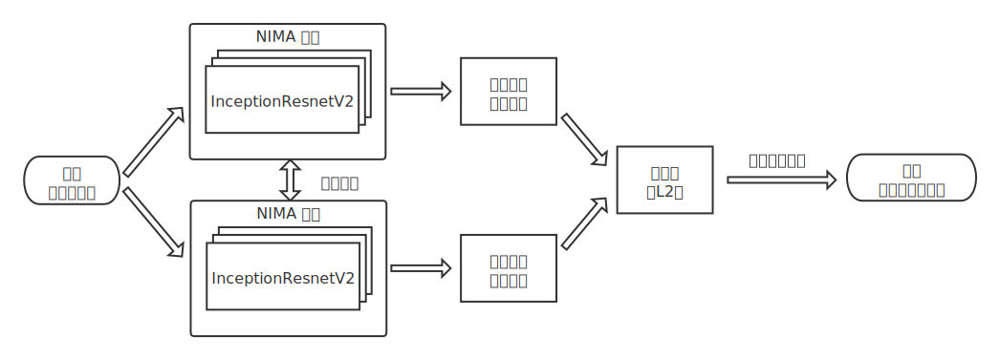

# Image Quality: Siamese NIMA

这里，基于谷歌提出的 NIMA<sup>[[1]](#参考)</sup>（Neural Image Assessment）模型，结合 Siamese Network<sup>[[2]](#参考)</sup>（孪生网络结构），组成 **Siamese NIMA 网络模型**，优化模型对图像质量评价的区分度（即精排能力）。

## 网络结构

NIMA 模型对图像质量评价的能力主要来自训练目标和损失函数的创新。此模型通过 EMD<sup>[[1]](#参考)</sup>（Earth Mover's Distance）损失函数优化模型对评分分布的预测能力，而非单纯将图像质量评价任务视为多分类任务。

因为 NIMA 模型需要学习图像的评分分布，所以训练样本使用了包含大量美学图像和用户在 1～10 等级投票结果的 AVA<sup>[[3]](#参考)</sup>（A Large-Scale Database for Aesthetic Visual Analysis） 数据集。

通过上述训练样本和损失函数的设计，NIMA 模型对图像质量评价拥有一定的感知能力，能够在宏观上区分图像质量好坏。但是在预测评分的区分度上，NIMA 模型不容易满足精排的要求。因此这里使用 Siamese NIMA 进行优化。Siamese NIMA 利用了孪生网络结构的特点，得以使模型获得一定的精排能力。

Siamese NIMA 网络结构如下图所示。


训练时，使用 AVA 数据集对图像平均得分进行分桶，构建样本对和标签，复用 NIMA 模型进行权值共享，从而利用孪生网络结构调整 NIMA 模型网络权重，优化模型对图像质量精排的距离损失。

## 预训练权重

**TL;DR**：预训练权重均上传至 [Releases](https://github.com/ryanfwy/image-quality/releases)，请根据不同目的下载相应权重并置于 `./assets/weights/` 目录（非必须）。

基于 InceptionResnetV2 的 NIMA 模型权重由 [titu1994](https://github.com/titu1994/neural-image-assessment/releases/tag/v0.5) 提供<sup>[[4]](#参考)</sup>，使用预训练模型权重作为 Siamese NIMA 的权值共享网络部分，可以免去重新训练 NIMA 模型过程，直接利用孪生网络结构进行微调。

在预训练 NIMA 模型权重基础上，冻结浅层网络来保留模型对图像的通用表达能力，使用孪生网络结构微调和优化深层网络参数，从而增强模型对图像质量评价的区分度，且在训练样本不多的情况下也能获得较好的训练效果。默认冻结层设置为 `layer_to_freeze=618`。

训练后将 NIMA 模型从 Siamese NIMA 模型结构中分离，单独保存 NIMA 模型部分的权重，即可在预测时直接使用 NIMA 模型结构和微调后的权重，而非孪生结构的 Siamese NIMA。

> 如果希望以孪生网络结构重新训练模型，则可以在训练时去除 `nima_weight_path` 参数。但此时模型没有使用 NIMA 模型的 EMD 损失进行优化，所以严格意义上共享网络是一个纯 InceptionResnetV2 模型而非 NIMA 模型，缺乏对图像质量评价的感知能力。或者读者可以自己额外训练 NIMA 模型权重，再将训练好的权重文件路径传递到训练中，接着利用孪生网络结构进行微调。

## 结果对比

Todo。

## 运行环境参考

模型训练和预测均在 AWS EC2 服务器上执行。由于物理机是否带有 GPU 与带 GPU 的型号情况复杂，因此列举以下关键运行环境以供参考。关于主要运行环境的部署说明，请参考[运行环境配置](#运行环境配置)。

- 物理环境：
    - CPU 型号 ：4 * Intel(R) Xeon(R) CPU E5-2686 @ 2.30GHz
    - CPU 内存：64GB
    - GPU 型号：1 * Nvidia Tesla V100
    - GPU 内存：16GB
- 运行环境：
    - python：3.6.5
    - keras：2.2.4
    - tensorflow-gpu：1.12.0
    - numpy：1.15.4（注：版本过新可能会与 tensorflow 后端出现兼容问题）

## 运行环境配置

### 1. 安装 Python 3

系统环境不同，安装方式也有所不同，具体请参考 https://www.python.org/downloads 。建议 Python 版本不低于 `3.6`。

检查已存在版本或检查安装是否成功：

```bash
# Python 3.6.5
python3 -V
```

### 2. 拉取仓库

```bash
git clone https://github.com/ryanfwy/image-quality.git
cd image-quality
```

### 3. 创建虚拟环境（推荐）

由于 tensorflow 后端与依赖包有一定兼容问题，因此建议在虚拟环境安装依赖包。

若使用 Anaconda：

```bash
conda create --name image_quality python=3.6
source activate image_quality
```

或使用原生环境：

```bash
python3 -m venv .env
source .env/bin/activate
```

### 4-1. 安装依赖包

1）为避免兼容问题，建议安装 Tensorflow 1.12.0。

若只在 CPU 环境运行，则：

```bash
pip3 install numpy==1.15.4 Keras==2.2.4 tensorflow==1.12.0
```

若在 GPU 环境运行，则：

```bash
pip3 install numpy==1.15.4 Keras==2.2.4 tensorflow-gpu==1.12.0
```

2）剩余部分依赖环境：

```bash
pip3 install -r requirements.txt
```

### 4-2. 安装依赖包（懒人版）

如果不需要自定义安装版本，可以使用提供的 [installation.sh](./installation.sh) 脚本快捷安装依赖包。

**注意**：运行前请确保 GPU 驱动已经安装成功，否则脚本无法正常判断 GPU 版本。

```bash
bash installation.sh
```

## 训练和预测

### 1. 训练模型

如果需要自行训练模型，需要提前准备下载好的训练图像与数据文件，数据文件至少包含`文件名`和`标签`两列。以 [Demo](./assets/demo/) 为例，目录结构和数据文件如下。

图像目录：

```
./train_images
 |- 267683.jpg
 |- 774992.jpg
 |- ...
 |_ 1246918.jpg
```

数据文件 `train_data.csv`：

```
file_name label
267683.jpg 1
774992.jpg 2
775717.jpg 0
953019.jpg 4
953619.jpg 6
953958.jpg 3
954113.jpg 8
954184.jpg 7
954228.jpg 5
1246918.jpg 9
...
```

若训练时使用额外数据进行校验，可以依照上述方式准备图像目录和数据文件，在调用 `train()` 方式时传入 `val_raw` 参数。

训练脚本请见 [demo_train.py](./demo_train.py)，更多训练参数可参考 [fit_generator](https://keras.io/models/model/#fit_generator)。

```python
from model.siamese_nima import SiameseNIMA

# dirs and paths to load data
train_image_dir = './assets/demo/train_images'
train_data_path = './assets/demo/train_data.csv'

# load data and train model
siamese = SiameseNIMA(output_dir='./assets')
train_raw = siamese.load_data(train_image_dir, train_data_path)
siamese.train(train_raw,
              epochs=5,
              batch_size=16,
              nima_weight_path='./assets/weights/nima_pre_trained.h5')
```

### 2. 预测模型

使用 Siamese NIMA 模型进行预测时，除了需要准备预测图像，数据文件和数据加载方式需也要做一定修改：数据文件需至少包含`文件名`一列。

预测脚本请见 [demo_predict.py](./demo_predict.py)，更多预测参数可参考 [predict_generator](https://keras.io/models/model/#predict_generator)。

```python
from model.siamese_nima import SiameseNIMA

# dirs and paths to load data
predict_image_dir = './assets/demo/predict_images'
predict_data_path = './assets/demo/predict_data.csv'

# load data and train model
siamese = SiameseNIMA()
predict_raw = siamese.load_data(predict_image_dir, predict_data_path,
                                columns=['file_name'])
results = siamese.predict(predict_raw,
                          nima_weight_path='./assets/weights/nima_pre_trained.h5')
print(results)
```

## 参考

[1] NIMA: Neural Image Assessment. [[Paper]](https://arxiv.org/abs/1709.05424) [[Repo]](https://github.com/titu1994/neural-image-assessment)  
[2] Siamese Network. [[Demo]](https://github.com/keras-team/keras/blob/master/examples/mnist_siamese.py)  
[3] AVA: A Large-Scale Database for Aesthetic Visual Analysis. [[Refer]](https://www.dpchallenge.com/) [[Repo]](https://github.com/mtobeiyf/ava_downloader)  
[4] neural-image-assessment. [[Reop]](https://github.com/titu1994/neural-image-assessment)

## 协议

此仓库许可协议为 [MIT](./LICENSE)。
